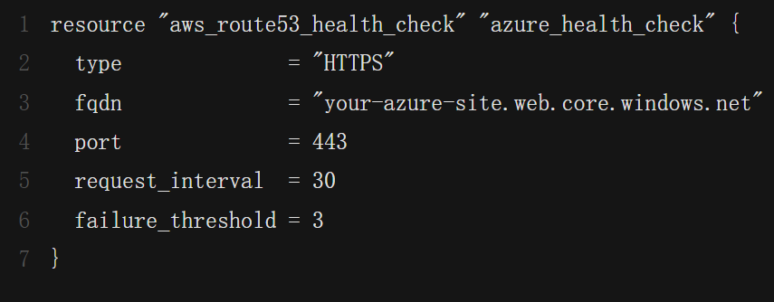

# Project backgroud
This project aims to deploy a weather tracker application across AWS and Azure, incorporating disaster recovery capabilities. 

The app's front-end (HTML, CSS, JS) is hosted statically on AWS S3 (with CloudFront for CDN) and Azure Blob Storage.

The entire infrastructure is managed using Terraform, automating deployments on both cloud platforms.

Services Needed in the project:

1.Terraform: Automate multi-cloud infrastructure provisioning. [Infrastructure as Code]
2.AWS S3
3.AWS CloudFront
4.Route 53: Automate failover between AWS and Azure functions.
5.Azure Azure Blob Storage

### Diagram
the architectural diagram for the project:


### Steps

1. Install Terraform, Configure AWS, Azure CLI
2. Define AWS Resources using Terraform
3. Define Azure Resources using Terraform
4. Implement Disaster Recovery with Route 53 DNS Failover


# Setp1 Install Terraform, Configure AWS, Azure CLI

### Install Terraform

for ubuntu

```vim 
wget -O - https://apt.releases.hashicorp.com/gpg | sudo gpg --dearmor -o /usr/share/keyrings/hashicorp-archive-keyring.gpg
echo "deb [arch=$(dpkg --print-architecture) signed-by=/usr/share/keyrings/hashicorp-archive-keyring.gpg] https://apt.releases.hashicorp.com $(grep -oP '(?<=UBUNTU_CODENAME=).*' /etc/os-release || lsb_release -cs) main" | sudo tee /etc/apt/sources.list.d/hashicorp.list
sudo apt update && sudo apt install terraform
```

```terraform version```

### AWS CLI

```aws configure```

Provide your Access Key ID, Secret Access Key, and default region.

validate the configuration:

```aws s3 ls```

### Azure CLI

```vim 
az login
az account show
az ad sp create-for-rbac --role="Contributor" --scopes="/subscriptions/<subscription-id>"
```


# Setp2 Define AWS Resources using Terraform

terraform command:

```vim
terraform apply -var-file="aws_credentials.tfvars" -var-file="azure_credentials.tfvars"
```

the terraform scripts in main.tf:

### define s3 bucket


### upload frontend files to s3


### configure bucket policy 


### access the webpage using s3 static hosting 


# Setp3 Define Azure Resources using Terraform

### define resources group


### upload files 


### azure console for storage account


### access the webpage via the Azure Storage Account's public URL


# Setp4 Implement Disaster Recovery with Route 53 DNS Failover

1. Buy and Register a Domain Name
2. Create a Hosted Zone in Route 53
3. Request an SSL Certificate for CloudFront
4. Configure CloudFront with Alternate Domain Names
5. Define Health Checks for Failover
6. Setup Route 53 Records for Failover
7. Update Namecheap Nameservers
8. Verify DNS Propagation


### Hosted Zone in Route 53

 Add the code to main.tf file


### Request an SSL Certificate for CloudFront

Request a SSL Certificate:
1. Go to AWS Certificate Manager (ACM).
2. Request a public certificate for `yourdomain.com` and `www.yourdomain.com`.
3. Validate the certificate using DNS validation (recommended).
4. Once the certificate is issued, associate it with your CloudFront distribution.

### Configure CloudFront with Alternate Domain Names

Configure CloudFront with Alternate Domain Names
After obtaining an SSL certificate:

1. Go to CloudFront → Select your distribution.
2. Add Alternate Domain Names (CNAMEs):
`yourdomain.com`
`www.yourdomain.com`
3. Attach the ACM Certificate to the distribution.

### Define Health Checks using Terraform

Primary Aws


Secondary Azure




### Setup Route 53 Records for Failover

Primary Record (AWS - CloudFront)


Secondary Record (Azure - Blob Storage)


### Update Domain Nameservers
To use Route 53 as your DNS provider, update the domain’s nameservers.

### Access the website using domain address


# Project Conclusion

This project demonstrated how to design and deploy a Multi-Cloud website with built-in disaster recovery using Terraform, AWS, and Azure. Through a series of steps, we have defined and provisioned cloud resources on both platforms using Infrastructure as Code (IaC), ensuring a repeatable and scalable deployment process.

Key achievements include:
Deploying a weather tracking application across AWS and Azure for high availability.
Automating resource provisioning using Terraform modules.
Configuring Route 53 DNS failover to automatically switch traffic between cloud environments during outages.

By completing this project, you've learned how to build a resilient, production-grade, multi-cloud system, gaining hands-on experience in cloud infrastructure automation, disaster recovery, and DNS-based failover strategies.

