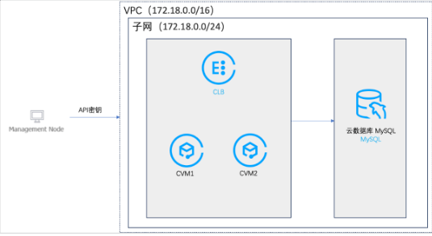
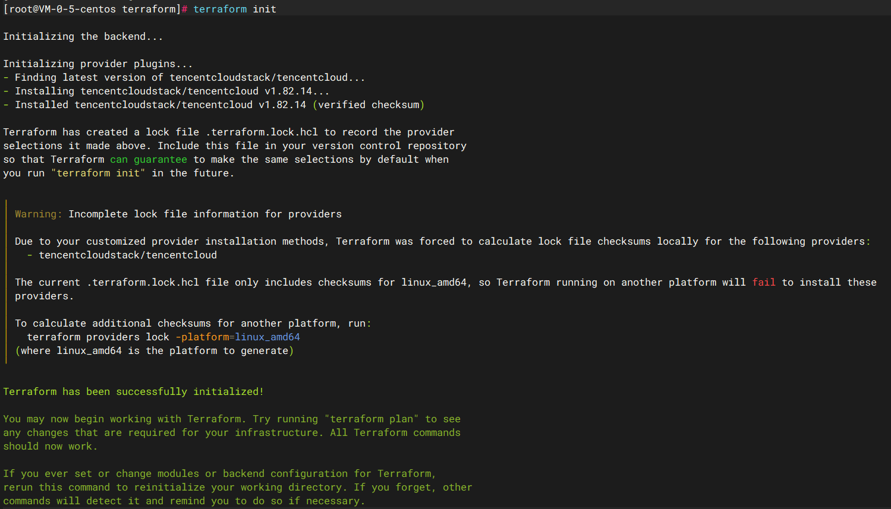
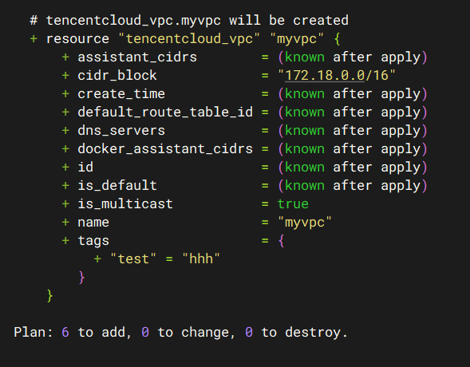
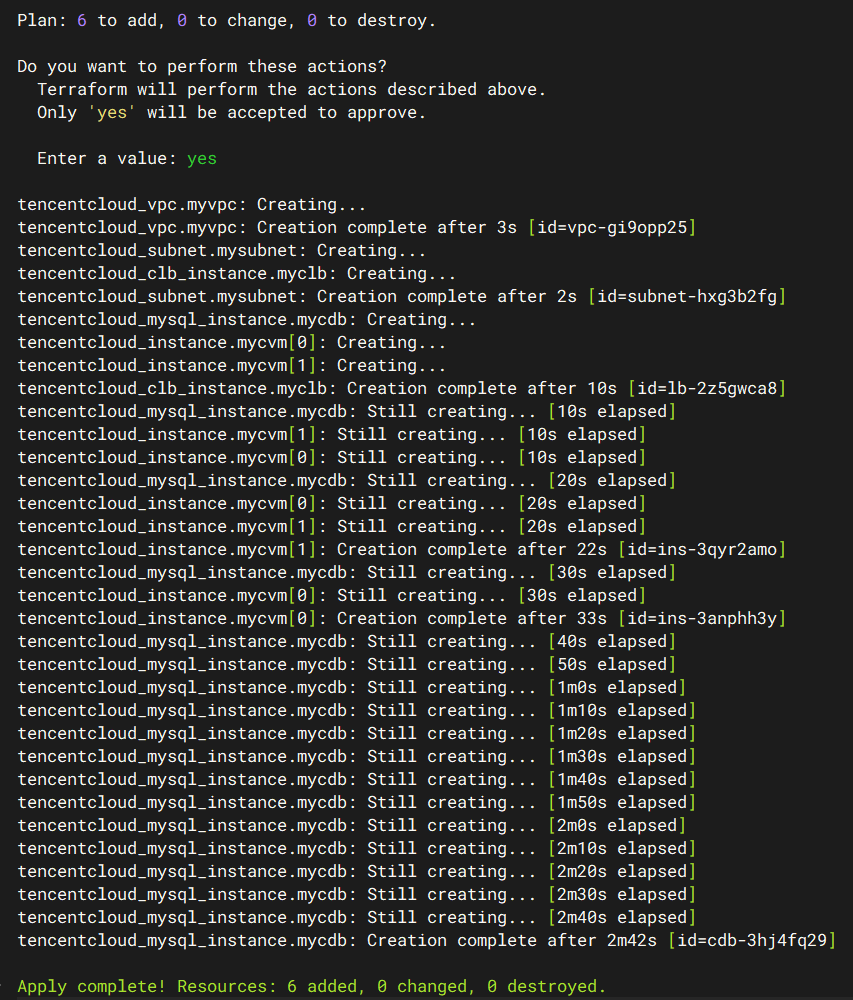
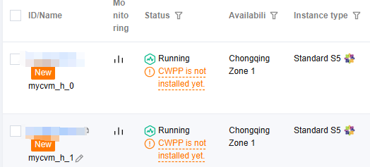
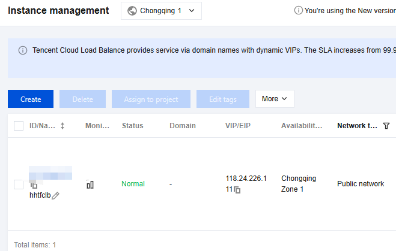
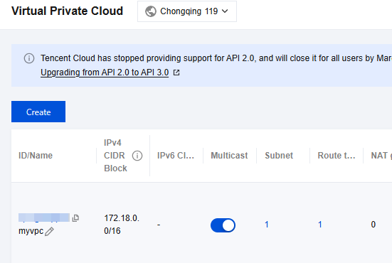
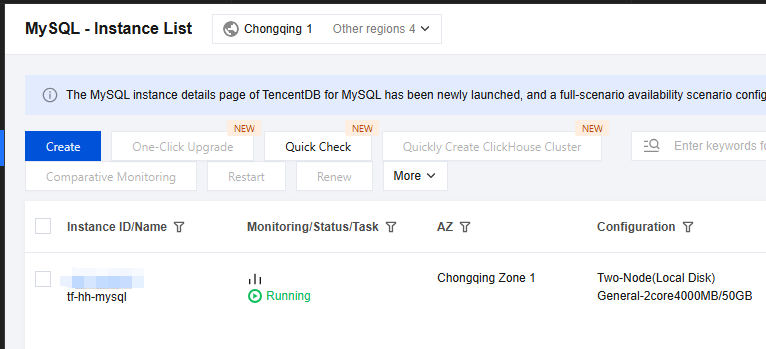
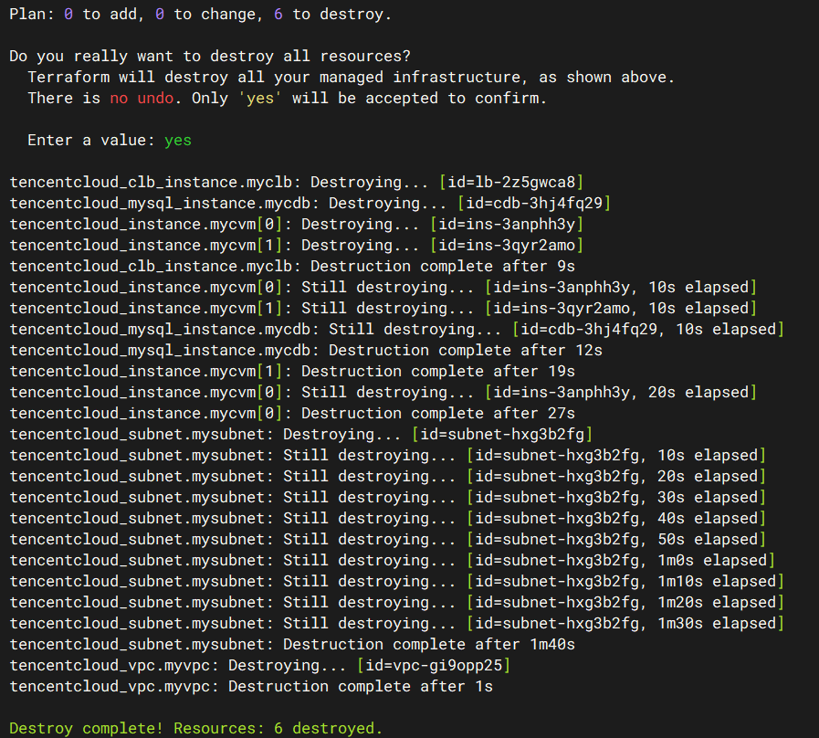

# Project backgroud
In current public cloud business practices, many complex architectures require multiple cloud products/services to operate in tandem. Each category of cloud products involves numerous parameters, and ​any misconfiguration could introduce unforeseen business risks. This significantly elevates requirements for cloud platform engineers.
Customers increasingly seek to ​automate foundational operations​ (e.g., resource procurement) through templates, such as:

Automatically provisioning pre-designed infrastructure by calling cloud APIs.
​Batch-deploying​ specified quantities of business virtual machines with designated images to handle traffic surges.
​Rapidly releasing​ resources post-operation to optimize costs.

​Solution: Tencent Infrastructure Automation for Terraform​
Tencent Infrastructure Automation for Terraform leverages the globally adopted ​Infrastructure as Code (IaC)​​ framework Terraform via its plugin ecosystem. This solution delivers automated capabilities for ​deploying, implementing, and managing​ cloud resources.


Use Terraform to create resources automatically in Tencent Cloud

Project Steps:​

​1、Configure the Terraform runtime environment​
​2、Create Terraform resource provisioning scripts​
​3、Execute commands to provision resources, then verify in the console whether resources are deployed as expected
​4、Automatically destroy provisioned infrastructure​ using Terraform commands

The final goal of this project：



# Step1 Configure the Terraform runtime environment​

## Install terraform:

install directly:

sudo yum install -y yum-utils

sudo yum-config-manager --add-repo https://rpm.releases.hashicorp.com/RHEL/hashicorp.repo

sudo yum -y install terraform

download and unzip:

wget https://releases.hashicorp.com/terraform/1.6.3/terraform_1.6.3_linux_amd64.zip

unzip terraform_1.6.3_linux_amd64.zip

cp terraform /usr/sbin/

## Configure id&key 

terraform version

vim provider.tf

```vim
terraform {
  required_providers {
    tencentcloud = {
      source = "tencentcloudstack/tencentcloud"
      # the version of tencentcloud
    }
  }
}

provider "tencentcloud" {
  region = "ap-chongqing"
  #the area of resources
  secret_id = "my-secret-id"
  #get the secret_id from Tencent Cloud Console
  secret_key = "my-secret-key"
  #get the secret_key from the console
}
```
vim /root/.terraformrc

terraform init



successfully initialized

# Step2 Create Terraform resource provisioning scripts​
## Tencent Cloud Terraform Resource Declaration Syntax Reference

refer to the offical docs of Terraform for Tencent Cloud:

https://registry.terraform.io/providers/tencentcloudstack/tencentcloud/latest/docs/resources/instance


## main.tf
The ​main.tf​ file is typically referred to as a ​Terraform configuration. This file specifies the desired infrastructure resources. While it can be named arbitrarily, it is conventionally named ​main.tf

vim main.tf

```vim
data "tencentcloud_images" "myimage" {
  image_type = ["PUBLIC_IMAGE"]
  os_name    = "centos 7.5"
}

data "tencentcloud_instance_types" "myinstancetype" {
  filter {
    name = "instance-family"
    values = ["S5"]
  }
  cpu_core_count = 2
  memory_size    = 8
}
# virtual machine

data "tencentcloud_availability_zones_by_product" "zones" {
  product = "cdb"
}
# database instance
```

## Virtual Network

vim vpc.tf

```vim
resource "tencentcloud_vpc" "myvpc" { 
  name       = "myvpc"  #vpc name
  cidr_block = "172.18.0.0/16"  #vpc cidr
  tags = {      #label
    "test" = "test"
  }
}
resource "tencentcloud_subnet" "mysubnet" {  #subnet
  vpc_id = tencentcloud_vpc.myvpc.id    #subnet 
  name = "mysubnet"  #subnet name
  availability_zone = "ap-chongqing-1" #subnet area az
  cidr_block = "172.18.0.0/24"  #subnet cidr
}
```

## Virtual Machine

vim cvm.tf

```vim
resource "tencentcloud_instance" "mycvm" { 
  count = 2       
  instance_name  = "mycvm_${count.index}"  
  availability_zone = "ap-chongqing-1"  
  instance_type = data.tencentcloud_instance_types.myinstancetype.instance_types.0.instance_type 
  image_id      = data.tencentcloud_images.myimage.images.0.image_id  
  vpc_id        = tencentcloud_vpc.myvpc.id  
  subnet_id     = tencentcloud_subnet.mysubnet.id   
  system_disk_type  = "CLOUD_BSSD"  
  system_disk_size  = 50       
  hostname = "user${count.index}"  
  private_ip = ""               
  password = "XXXXXX"       
  data_disks {                      
    data_disk_type = "CLOUD_BSSD" 
    data_disk_size = 200         
    encrypt        = false      
  }
}
```

## Database

vim cdb.tf

```vim
resource "tencentcloud_mysql_instance" "mycdb" {  
  engine_version    = "5.7"        
  charge_type       = "POSTPAID"   
  root_password     = "XXXXXX"  
  slave_deploy_mode = 0   #备节点部署模式，1为多可用区部署，0为单可用区部署，重庆地域只有一个可用区
  availability_zone = data.tencentcloud_availability_zones_by_product.zones.zones.0.name
  #主可用区，引用main.tf里面的定义
  first_slave_zone  = data.tencentcloud_availability_zones_by_product.zones.zones.0.name
  #第一从可用区，引用main.tf里面的定义，因为重庆地域只有一个可用区，主可用区和从可用区设置一致
  slave_sync_mode   = 1    #数据同步方式，0为异步，1半同步，2为强同步
  instance_name     = "tf-mysql"  
  mem_size          = 4000        
  volume_size       = 50         
  vpc_id            = tencentcloud_vpc.myvpc.id   
  subnet_id         = tencentcloud_subnet.mysubnet.id  
  intranet_port     = 3306  
  tags = {  
    name = "mysql"
  }
  parameters = {  
    character_set_server = "utf8"
    max_connections      = "1000"
  }
}
```

## Load Balancer

vim clb.tf

```vim
resource "tencentcloud_clb_instance" "myclb" {
  network_type = "OPEN"  
  clb_name = "tfclb"   
  vpc_id = tencentcloud_vpc.myvpc.id  
  address_ip_version = "ipv4"  
  internet_charge_type = "TRAFFIC_POSTPAID_BY_HOUR" 
  }
```


# Step3 Run scripts to create resources

 terraform plan

 

 terraform apply

 

 Successfully created

 # Step4 Recheck in the console 
cvm

 

clb



vpc



database-mysql instance



# Step4 Automatically destroy resources

 terraform destroy

 

 ALL DONE