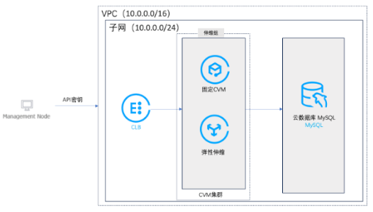
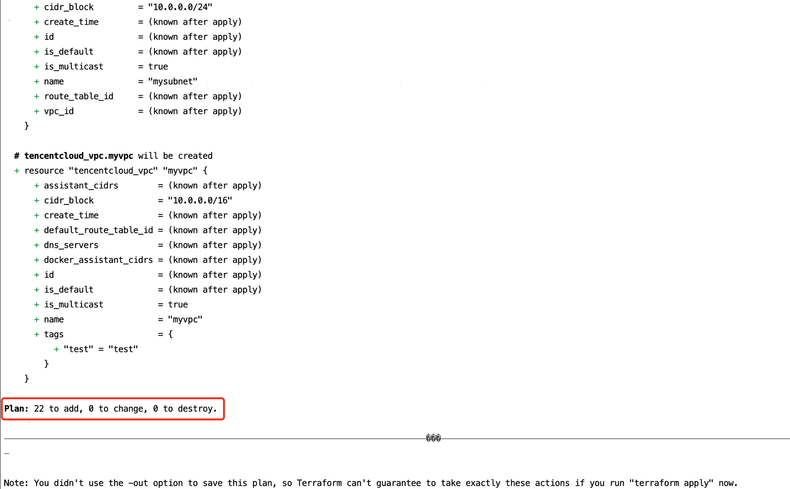
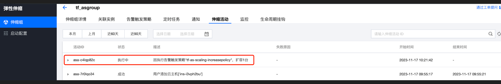
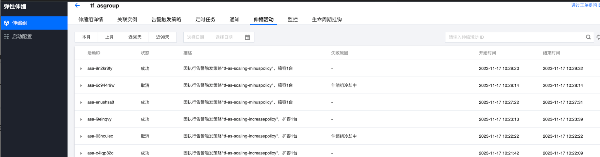

# Project backgroud


Automated Deployment of Highly Elastic AS Business System on Tencent Cloud​ using Terraform
​Objective:​​
Leverage Tencent Cloud account to activate CVM, database, CLB, and AS services, obtain API access keys, and implement automated deployment of an elastic AS-based cloud business system with the following capabilities:

1.​Configure Terraform runtime environment​

2.Author Terraform scripts​ for resource provisioning and configuration

3.Execute commands to provision resources, then verify in the console:

  Successful resource deployment
  
  Automated configuration generation

4.​Validate AS auto-scaling functionality​ in the console: Scale-out operations; Scale-in operations


5.​Automatically destroy provisioned infrastructure​ using Terraform commands

the architect graph of the project:



# Step1 Autoscaling scripts​

as.tf


```vim
resource "tencentcloud_as_scaling_config" "tf_asconfig" {
#创建AS的启动配置
  configuration_name = "tf_asconfig"
  image_id           = data.tencentcloud_images.myimage.images.0.image_id
  #指定镜像id，生产中通常是自定义镜像的id
  instance_types     = [data.tencentcloud_instance_types.myinstancetype.instance_types.0.instance_type]  #指定实例类型，引用main.tf定义的实例类型
  security_group_ids = [tencentcloud_security_group.cvmsg.id]  
  #指定安全组
  instance_name_settings {  #伸缩实例名
    instance_name = "tf-ins-name"
  }
}
resource "tencentcloud_as_scaling_group" "tf_asgroup" {
 #创建AS伸缩组
  scaling_group_name = "tf_asgroup"
  configuration_id   = tencentcloud_as_scaling_config.tf_asconfig.id
  # 指定伸缩配置为前面创建的伸缩配置
  max_size           = 3
  #最大伸缩组实例数量
  min_size           = 0
  #最小伸缩组实例数
  desired_capacity   = 0
  #期望实例数
  vpc_id             = tencentcloud_vpc.myvpc.id
  #指定实例在哪个vpc里面，引用前面创建vpc
  subnet_ids         = [tencentcloud_subnet.mysubnet.id]
  #指定实例在哪个subnet里面，引用前面创建subnet
  forward_balancer_ids {  
    load_balancer_id = tencentcloud_clb_instance.myclb.id
    #指定实例在哪个clb后端，引用前面创建clb
    listener_id      = tencentcloud_clb_listener.mylistener.listener_id
    #指定监听器，引用clb中创建的监听器
    rule_id          = tencentcloud_clb_listener_rule.mylistenerrule.rule_id
#指定监听规则，引用clb中创建的监听规则
    target_attribute {
      port   = 80    #后端池端口
      weight = 10    #转发权重
    }
  }
}
resource "tencentcloud_as_attachment" "attachment" { #设置关联实例
  scaling_group_id = tencentcloud_as_scaling_group.tf_asgroup.id
  #指定伸缩组id
  instance_ids     = [tencentcloud_instance.mycvm.id]
  #将之前创建的cvm加入到伸缩组里
}
resource "tencentcloud_as_protect_instances" "protect" {
#设置受保护实例，即缩容时不被弹出
  auto_scaling_group_id   = tencentcloud_as_scaling_group.tf_asgroup.id
  #指定伸缩组id
  instance_ids            = tencentcloud_as_attachment.attachment.instance_ids
  #引用导入受保护实例
  protected_from_scale_in = true
  #禁止弹出
}
resource "tencentcloud_as_scaling_policy" "as_increase" {
  #配置扩容规则
  scaling_group_id    = tencentcloud_as_scaling_group.tf_asgroup.id    #指定伸缩组id
  policy_name = "tf-as-scaling-increasepolicy" #指定伸缩规则名
  comparison_operator = "GREATER_THAN"         #比较符为大于阈值
  metric_name         = "CPU_UTILIZATION"      #指标名称为cpu利用率
  threshold           = 70                     #阈值为70%
  period              = 60                     #采样周期，单位秒
  continuous_time     = 3                      #连续次数
  statistic           = "AVERAGE"              #统计方式为平均值
  cooldown            = 60                     #冷却时间，单位秒
  adjustment_type     = "CHANGE_IN_CAPACITY"   #伸缩方式，按数量
  adjustment_value    = 1                      #增加1台
}
resource "tencentcloud_as_scaling_policy" "as_minus" { #配置缩容规则
  scaling_group_id    = tencentcloud_as_scaling_group.tf_asgroup.id   #指定伸缩组id
  policy_name         = "tf-as-scaling-minuspolicy"  #指定伸缩规则名
  comparison_operator = "LESS_THAN"           #比较符为小于阈值
  metric_name         = "CPU_UTILIZATION"     #指标名称为cpu利用率
  threshold           = 10                    #阈值为10%
  period              = 60                    #采样周期，单位秒
  continuous_time     = 3                     #连续次数
  statistic           = "AVERAGE"             #统计方式为平均值
  cooldown            = 60                    #冷却时间，单位秒
  adjustment_type     = "CHANGE_IN_CAPACITY"  #伸缩方式，按数量
  adjustment_value    = -1                    #减少1台
}
```

# Step2 Deployment ​

terraform apply



# Step3 Test autoscaling

Logon the Protected CVM Instance via Console to Install Testing Tools

```yum install -y sysbench unzip zip```

run sysbench to increase the usage of cpu

```sysbench cpu --cpu-max-prime=2000000 --threads=2 --time=1000 run```

The ​cpu-max-prime​ parameter in Sysbench CPU tests specifies the upper limit for prime number calculations. This parameter defines the range of prime numbers to be computed, from 2 up to the specified maximum value.

In this example, the parameter is set to ​2,000,000, meaning the test will calculate all prime numbers between 2 and 2,000,000. The test duration is configured for ​1,000 seconds.

After approximately ​3 minutes, observe the scaling activities of the Auto Scaling group to verify elasticity behavior.

## scale up



## scale down

